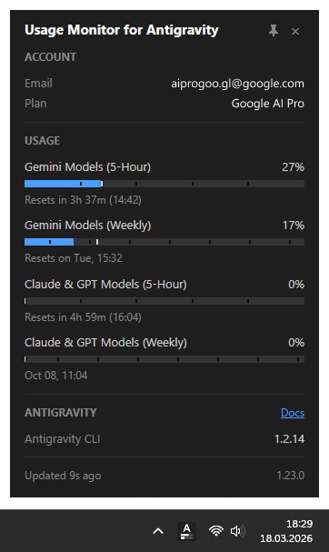

# Usage Monitor for Antigravity

> [!NOTE]
> ### Attribution & Acknowledgement
> This project is adapted and forked from the original [Usage Monitor for Claude](https://github.com/jens-duttke/usage-monitor-for-claude) created by [Jens Duttke](https://github.com/jens-duttke). All credits for the original tray monitoring architecture, event loop designs, and UI concepts belong to Jens Duttke and contributors. This fork customizes the core quota engine to monitor **Google Antigravity (`agy`)** usage and rate limits.

**Monitor your Google Antigravity (`agy`) rate limits in real time - right from your system tray.**

A native tray app for Windows and Linux that shows your Antigravity usage at a glance - lightweight, fast, and fully auditable. Always know how much of your session and weekly limits you have left:
- **Gemini Models**: 5-Hour session limit & Weekly limit
- **Claude & GPT Models**: 5-Hour session limit & Weekly limit



## Features

- **Portable on Windows** - single EXE (~15 MB), no installation, no Electron, no external runtime required. Download, place anywhere, run. To uninstall, delete the file. On Linux it runs from source against the GTK and WebKit libraries your desktop already ships
- **Zero configuration** - authenticates and reads quota directly through your local Antigravity CLI (`agy -p "/quota"`), auto-detecting your account email, plan tier, and model quotas
- **Live tray icon** with two configurable progress bars (Session + Weekly by default), or both values as stacked percentages via `icon_style`. Plus a tooltip showing both percentages and reset countdowns (Windows 128-char limit compliant), and theme-aware colors for light and dark taskbars
- **Detail popup** (left-click, or from the tray menu on Linux) with account info, tier details, reset countdowns, and real-time usage bars for both **Gemini Models** and **Claude & GPT Models**. Pin it open and drag it anywhere to keep usage visible during long sessions
- **Antigravity CLI versions** - the popup shows which version of the Antigravity CLI is installed and detected on your system
- **Smart alerts** - configurable threshold notifications per quota type, with time-aware mode that only alerts when usage outpaces elapsed time
- **[Event commands](docs/event-commands.md)** - run a custom shell command when a quota resets, a usage threshold is crossed, or the app starts up
- **Time marker** on every bar, in the popup and on the tray icon alike, showing how much of the current period has elapsed - so you see at a glance whether your usage is ahead of or behind the clock. Bars that outpace it turn red
- **Adaptive polling** - speeds up during active usage, slows down when the computer is idle or locked, aligns to imminent quota resets, and recovers smoothly after system standby
- **13 languages** (English, German, French, Spanish, Portuguese, Italian, Japanese, Korean, Hindi, Indonesian, Chinese Simplified, Chinese Traditional, Ukrainian) - auto-detected from your system's display language, with optional manual override via the `language` setting
- **[Customizable](docs/configuration.md)** - optionally override polling intervals, colors, alert thresholds, and more via a JSON settings file

---

## Security & Transparency

This tool queries your local Antigravity CLI (`agy`), so you should be able to verify it is safe:

- **Local CLI execution** - queries `agy -p "/quota"` locally on your machine
- **Credentials stay local** - never logged, stored elsewhere, copied, or transmitted to any third party
- **Touches almost nothing** - usage data lives in memory only. On Windows the app writes no files; its only registry entries are under `HKEY_CURRENT_USER` (notification identity and optional autostart)
- **No dynamic code execution** - no `eval()`, `exec()`, `compile()`, or dynamic imports
- **Minimal runtime dependencies** - only well-known packages: [requests](https://pypi.org/project/requests/), [Pillow](https://pypi.org/project/pillow/), [pystray](https://pypi.org/project/pystray/), [pywebview](https://pypi.org/project/pywebview/)

---

## Requirements

- **Windows 10 or Windows 11** (64-bit), or **Linux** with a freedesktop desktop environment
- **Google Antigravity** account / subscription
- **[Antigravity CLI](https://antigravity.google/docs)** (`agy`) installed and logged in on your system.

---

## How to Use

| Action | What happens |
|---|---|
| **Hover** over the tray icon | Tooltip shows 5h and Weekly usage percentages with reset times |
| **Left-click** the tray icon | Opens the detail popup with account info and all usage bars |
| **Double-click** the tray icon | Runs your [quick action](docs/event-commands.md) if configured; otherwise opens popup |
| **Right-click** the tray icon | Context menu: open popup, autostart toggle, test event commands, restart, or quit |
| **Escape** or click outside | Closes the detail popup |

### Tray icon not visible?

Windows may hide new tray icons by default. To keep the icon always visible:

1. Right-click the **taskbar** → **Taskbar settings**
2. Expand **Other system tray icons** (Win 11) or **Select which icons appear on the taskbar** (Win 10)
3. Toggle **UsageMonitorForAntigravity** to **On**

### Reading the progress bars

Each bar in the detail popup has up to four visual elements:

1. **Blue fill** - how much of the limit you have used
2. **Time dividers** - subtle gaps splitting the session bar into equal hour sections and marking local midnights on weekly bars
3. **White vertical line** - how much *time* has passed in the current period. The fill turns **red** when it passes this marker, warning that you may hit the limit before the period resets
4. **Reset text** - when the limit resets, shown as a countdown with clock time

---

## Configuration

All settings work out of the box - no configuration file is needed. To customize behavior, create a file called `usage-monitor-settings.json` with only the keys you want to change:

```json
{
  "poll_interval": 180,
  "bar_fg": "#00cc66",
  "bar_fg_warn": "#ff6600"
}
```

The app searches for this file in these locations (first match wins):

1. **`$ANTIGRAVITY_CONFIG_DIR/usage-monitor-settings.json`** (when a custom config directory is set)
2. **Next to the EXE** (or project root when running from source)
3. **`~/.gemini/usage-monitor-settings.json`**

The app never creates or modifies this file. See [Configuration](docs/configuration.md) for all available settings.

---

## Building from Source

<details>
<summary>For developers who want to build the EXE themselves</summary>

### Prerequisites

- Python 3.10+
- pip

### Setup

Windows:

```bash
git clone https://github.com/aryahmdm/usage-monitor-for-antigravity.git
cd usage-monitor-for-antigravity
python -m venv .venv
.venv\Scripts\activate
pip install -r requirements.txt
```

Linux:

```bash
sudo apt install python3-venv python3-gi gir1.2-webkit2-4.1 \
                 gir1.2-ayatanaappindicator3-0.1 libayatana-appindicator3-1

python3 -m venv --system-site-packages .venv
source .venv/bin/activate
pip install -r requirements.txt
```

### Run

```bash
python -m usage_monitor_for_antigravity
```

### Build EXE (Windows)

```bash
python build.py
```

Produces `dist/UsageMonitorForAntigravity.exe`, a standalone executable bundling Python and dependencies.

### Popup UI Development

The popup UI lives in [`usage_monitor_for_antigravity/popup/`](usage_monitor_for_antigravity/popup/) as separate HTML, CSS, and JS files. To preview and iterate on the UI without running the full app:

```bash
start http://localhost:8080/usage_monitor_for_antigravity/popup/dev.html && python -m http.server 8080
```

</details>

---


---

## Antivirus Warnings

Windows Defender or other antivirus tools may occasionally flag standalone executables built with PyInstaller as unrecognized or suspicious (false positive).

This is a known occurrence with standalone Python programs because all Python runtime binaries and dependencies are packaged together without an installer.

If you encounter a warning:
1. **Auditable Codebase**: The entire source code is available in this repository for inspection.
2. **Build from Source**: You can compile the binary yourself using python build.py as detailed in [Building from Source](#building-from-source).
3. **SmartScreen / Exclusion**: Click **More info -> Run anyway** or add a trusted exclusion in Windows Security.

## License & Credits

- Adapted and maintained for Antigravity (`agy`).
- Originally created by [Jens Duttke](https://github.com/jens-duttke) as [Usage Monitor for Claude](https://github.com/jens-duttke/usage-monitor-for-claude) under the MIT License.
- Released under the [MIT License](LICENSE).
